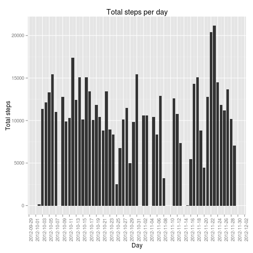
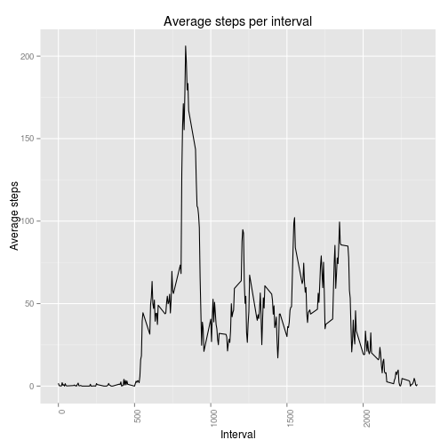
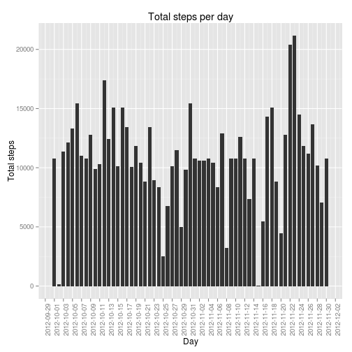
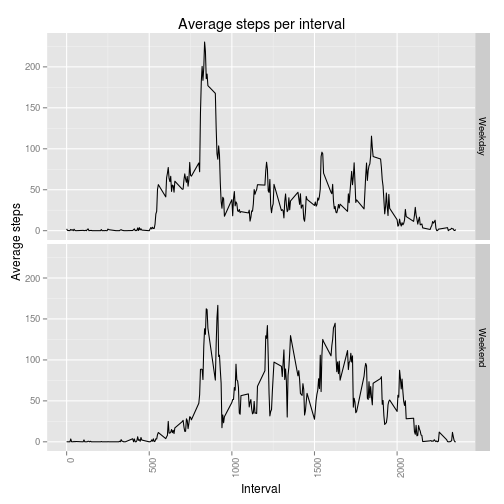

## "Reproducible Research: Peer Assessment 1"

#### Preliminary commands
First of all, useful libraries are loaded and the working directory is set.

```r
library(ggplot2)
library(knitr)
# Set working directory
setwd("~/Documenti/Coursera/DS5_Reproducible_Research/Prj1/RepData_PeerAssessment1/")
```

#### Loading and preprocessing the data


```r
# Load the dataset
fileN <- "../dataset/activity.csv"
ds_activity <- read.csv(fileN, header=TRUE, sep=",", na.strings="NA")
#
# Convert dates
ds_activity$date <- as.Date(ds_activity$date, "%Y-%m-%d")
str(ds_activity)
```

```
## 'data.frame':	17568 obs. of  3 variables:
##  $ steps   : int  NA NA NA NA NA NA NA NA NA NA ...
##  $ date    : Date, format: "2012-10-01" "2012-10-01" ...
##  $ interval: int  0 5 10 15 20 25 30 35 40 45 ...
```


#### What is mean total number of steps taken per day?
Calculating the sum with a for loop, then mean and median steps per day.


```r
dates <- data.frame(unique(ds_activity$date))
for (i in 1:dim(dates)[1]) {
   dates[i, 2] <- sum(ds_activity$steps[ds_activity$date == dates[i, 1]], na.rm=FALSE)
}
names(dates) <- c("Day", "Total_steps")
total_mean_steps <- mean(dates[, 2], na.rm=TRUE)
total_median_steps <- median(dates[, 2], na.rm=TRUE)

pl <- ggplot(dates, aes(x = Day, y = Total_steps, group=1)) +
      theme(axis.text.x = element_text(size = rel(1.0), angle = 90, hjust = 1)) +
      labs(x = "Day",
           y = "Total steps") +
      ggtitle("Total steps per day") +
      scale_x_date(breaks="2 day")

pl + geom_bar(stat = "identity", position = "stack", width=0.8)
```

```
## Warning: Removed 8 rows containing missing values (position_stack).
```

 

The mean total number of steps taken per day is 1.0766 &times; 10<sup>4</sup>, while the median total number of steps taken per day is 10765.
These value do not greatly differ from the ones calculated at the beginning of the assignment. In particular, the mean is the same while the median has slightly changed.
The impact on the estimates of the total daily number of steps is therefore low.


#### What is the average daily activity pattern?


```r
daily_pattern <- data.frame(unique(ds_activity$interval))
for (i in 1:dim(daily_pattern)[1]) {
   daily_pattern[i, 2] <- 
      mean(ds_activity$steps[ds_activity$interval == daily_pattern[i, 1]], na.rm=TRUE)
}
names(daily_pattern) <- c("Interval", "Average_steps")

max_interval <- daily_pattern[which(daily_pattern$Average_steps==max(daily_pattern$Average_steps)),1]

pl2 <- ggplot(daily_pattern, aes(x = Interval, y = Average_steps, group=1)) +
      theme(axis.text.x = element_text(size = rel(1.0), angle = 90, hjust = 1)) +
      labs(x = "Interval",
           y = "Average steps") +
      ggtitle("Average steps per interval")

pl2 + geom_line(width=0.8)
```

 

The 5-minutes interval which contains the maximum average steps (averaged over all the days) is 835 minutes.

#### Imputing missing values

```r
nas <- as.vector(which(is.na(ds_activity[,1])))
```

The total number of missing values is 2304. Now substituting missing values with the average steps for the same interval.


```r
# New database
ds_activity_2 <- ds_activity

# NA substitution with average steps for the same interval
for (i in 1:length(nas)) {
   nainterv <- ds_activity$interval[nas[i]]
   avg <- daily_pattern$Average_steps[daily_pattern$Interval == nainterv]
   ds_activity_2[nas[i], 1] <- avg
}

dates2 <- data.frame(unique(ds_activity_2$date))
for (i in 1:dim(dates2)[1]) {
   dates2[i, 2] <- 
      sum(ds_activity_2$steps[ds_activity_2$date == dates2[i, 1]], na.rm=FALSE)
}
names(dates2) <- c("Day", "Total_steps")
total_mean_steps2 <- mean(dates2[, 2], na.rm=TRUE)
total_median_steps2 <- median(dates2[, 2], na.rm=TRUE)

pl3 <- ggplot(dates2, aes(x = Day, y = Total_steps, group=1)) +
   theme(axis.text.x = element_text(size = rel(1.0), angle = 90, hjust = 1)) +
   labs(x = "Day",
        y = "Total steps") +
   ggtitle("Total steps per day") +
   scale_x_date(breaks="2 day")

pl3 + geom_bar(stat = "identity", position = "stack", width=0.8)
```

 


The mean total number of steps taken per day is 1.0766 &times; 10<sup>4</sup> (was 1.0766 &times; 10<sup>4</sup>), while the median total number of steps taken per day is 1.0766 &times; 10<sup>4</sup> (was 10765).

#### Are there differences in activity patterns between weekdays and weekends?

As can be noted below, during weekday the average steps per interval start to increase after the 500-min interval, while during weekend the average increases later. During the weekend there are slightly higher peaks between 1200 minutes and 1700 minutes.


```r
wdwe <- vector(mode="character", length=dim(ds_activity_2)[1])
for (i in 1:dim(ds_activity_2)[1]) {
   wd <- weekdays(ds_activity_2[i, 2])
   if (wd == "Saturday" | wd == "Sunday"){
      wdwe[i] <- "Weekend"
   }
   else {
      wdwe[i] <- "Weekday"
   }
}

wdwe <- as.factor(wdwe)

daily_pattern2 <- data.frame(unique(ds_activity_2$interval))
daily_pattern2 <- rbind(daily_pattern2, daily_pattern2)

n4 <- as.numeric(dim(daily_pattern2)[1])
n2 <- n4/2
n3 <- n2+1

for (i in 1:n2) {
   daily_pattern2[i, 2] <-
      mean(ds_activity_2$steps[
         ds_activity_2$interval == daily_pattern2[i, 1] &
         wdwe == "Weekend"
            ], na.rm=TRUE)
   daily_pattern2[i, 3] <- "Weekend"
}

for (i in n3:n4) {
   daily_pattern2[i, 2] <-
   mean(ds_activity_2$steps[
      ds_activity_2$interval == daily_pattern2[i, 1] &
         wdwe == "Weekday"
      ], na.rm=TRUE)
   daily_pattern2[i, 3] <- "Weekday"
}

names(daily_pattern2) <-
   c("Interval", "Average_steps", "wdwe")

pl4 <- ggplot(daily_pattern2, aes(x = Interval, y = Average_steps, group=1)) +
   theme(axis.text.x = element_text(size = rel(1.0), angle = 90, hjust = 1)) +
   labs(x = "Interval",
        y = "Average steps") +
   ggtitle("Average steps per interval") + 
   geom_line(width=0.8) + 
   facet_grid(wdwe ~ .)

pl4
```

 
